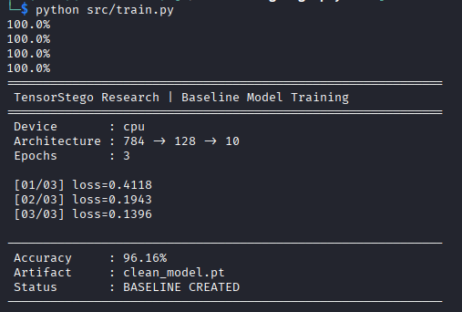
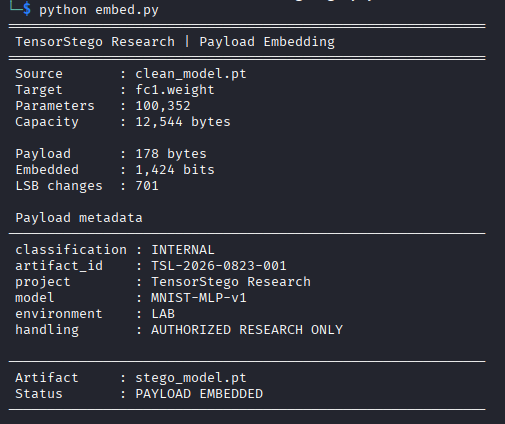
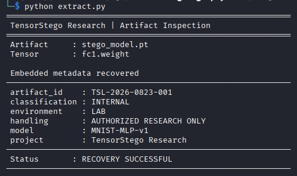
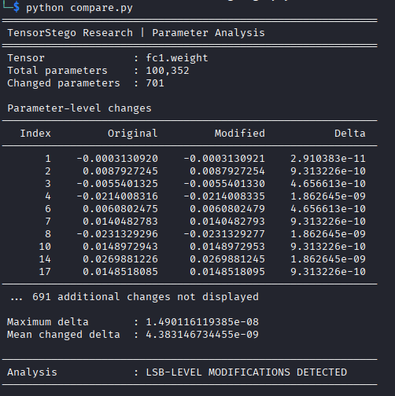
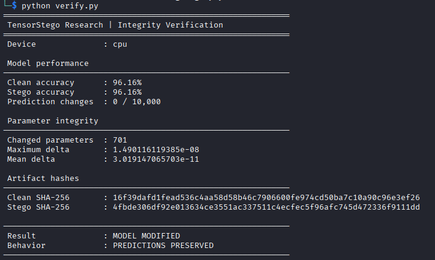

# Tensor Steganography Demo

A small PyTorch research demonstration showing how data can be
encoded into the least-significant bits of neural-network weights
while preserving approximately the same numerical parameter values.

## Purpose

This demonstrates:

- Neural-network weights stored as float32 tensors
- Least-significant-bit modification
- Encoding text into model parameters
- Recovering embedded data
- Comparing original and modified model weights

This demo uses only harmless text data and is intended for
educational security research.

## Setup

```bash
python3 -m venv venv
source venv/bin/activate

pip install -r requirements.txt
```

## Usage

Train a baseline MNIST model:

```bash
python /src/train.py
```

Embed the demonstration payload:

```bash
python src/embed.py
```

Extract: 

```bash
python /src/extract.py
```

Compare the models:

```bash
python src/compare.py
```

| Generated datasets and model files are excluded from version control.

## Results

### Figure 1 — Baseline Model Training

The baseline MNIST classifier is trained before any model parameters are modified.



### Figure 2 — Structured Metadata Embedded into Model Weights

A structured research payload is encoded into the least-significant bits of selected `float32` parameters in `fc1.weight`.



### Figure 3 — Recovery of Hidden Metadata from Model Weights

The embedded metadata is successfully recovered directly from the modified model parameters.



### Figure 4 — Parameter-Level Analysis of LSB Modifications

A comparison of the clean and modified models shows the individual parameter changes introduced during embedding. The changes remain extremely small at the numerical level.



### Figure 5 — Model Integrity and Performance Verification

The clean and steganographic models are evaluated side-by-side. Although the model artifact and selected parameters have changed, both models retain the same classification accuracy and produce identical predictions across the MNIST test set.




